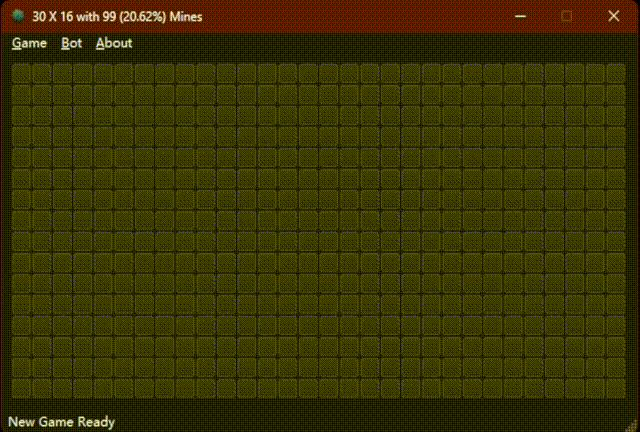

# MineSweeperBot

A MineSweeper game, with a MineSweeper bot.

---

A MineSweeper game

1. Clickable and markable
2. Multiple difficulty presets and custom options
3. Save & load
4. The first click and 8 lands around it are always safe

With a MineSweeper bot

1. Try solving with existed condition base on set difference
2. Try guessing with existed condition base on possibility
3. Automatic start new game and play continuously
4. Save game status on failure
5. Record statistic data about win rate, guess rate, etc

Bot win rate

1. Easy,      9 x  9 with 10 mines: 96.12%, guess accuracy: 79.09%, avg time: 0.43s (179k tests)
2. Moderate, 16 x 16 with 40 mines: 84.33%, guess accuracy: 76.49%, avg time: 0.52s (173k tests)
3. Hard,     36 x 16 with 99 mines: 39.13%, guess accuracy: 79.22%, avg time: 2.35s (151k tests)
